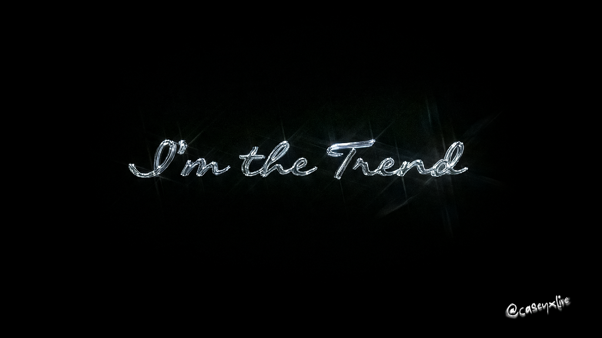

# Casey — Interactive macOS Desktop Portfolio

An interactive macOS desktop portfolio inspired by **[bychudy.com](https://www.bychudy.com/)**, built for **Casey**.



## ✨ Features
- **Spatial macOS Desktop Canvas**: Ambient dark background with custom liquid chrome `"I'm the Trend"` wallpaper (@caseyxlive).
- **27 Authentic Project Desktop Icons**: Scattered interactive desktop file icons with ultra-smooth 60fps/120fps drag-and-drop movement.
- **Glassmorphic Bottom macOS Dock**: Dock magnification hover scaling with solid app tiles (`Ae`, `Ps`, `Ai`, `Spotify`, `Notes`, `Photos`, `Instagram`, `Mail`, `Trash`).
- **Live Spotify Web Player App**: Integrated Spotify Web Player API showcasing Casey's top tracks playlist (`4eBpz8sWLVz9EfuPOY2NpW`).
- **macOS Window Manager**: Draggable window modals with Red/Yellow/Green window traffic light controls, depth z-index focus, and `ESC` shortcut to close.
- **Kajecik Notebook**: Tabbed modal view for About Casey, Experience/CV, and Creative Inspirations.

## 🚀 Quick Start

Launch a local web server:

```bash
# Using Python
python -m http.server 8080

# Or using Node.js npx
npx serve .
```

Open `http://localhost:8080/` in your browser.

## 📁 Project Structure

```
.
├── index.html            # Main macOS desktop HTML canvas
├── styles.css            # macOS glassmorphism & responsive CSS design system
├── app.js                # Window manager, rAF drag tracking & dock logic
├── data.js               # Structured portfolio data configuration
├── assets/
│   └── images/           # Custom background wallpaper & artwork assets
└── README.md
```
